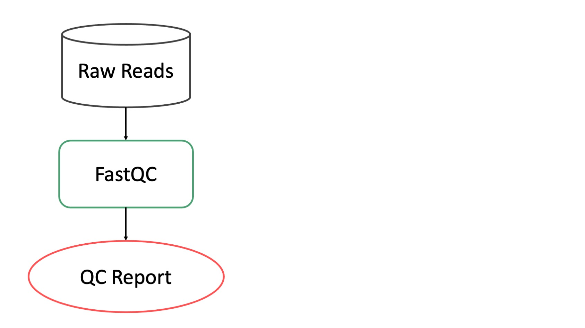

Modules
=======

Quality Control
^^^^^^^^^^^^^^^
.. _Quality Control:

FastQC
------
.. autoclass:: cap2.pipeline.preprocessing.FastQC

Preprocessing
^^^^^^^^^^^^^
.. _Preprocessing:
.. figure:: _static/subpipelines/preprocessing.jpeg
   :width: 600

The preprocessing subpipeline runs before all sections of the pipeline except for Quality Control. The preprocessing pipeline is meant to produce high quality clean data for the rest of the pipeline to consume.

Adapter Removal
---------------
.. autoclass:: cap2.pipeline.preprocessing.AdapterRemoval

Mouse Removal
-------------
.. autoclass:: cap2.pipeline.preprocessing.RemoveMouseReads

Human Removal
-------------
.. autoclass:: cap2.pipeline.preprocessing.RemoveHumanReads

Most microbiome samples contain some amount of human genetic material. There are two main sources for this: human contamination during sample preparation and human material present in samples from human (e.g. from a cheek swab). Removing human sequences reduces possible misidentification as a microbial taxon.

Human sequence removal relies on Hg38 with alternate contigs. Without alternate contigs large amounts of human sequence may not be identified in some samples. In some cases genuine microbial sequences may be misidentified as human sequences. This could be particularly true in studies of retroviruses. However, in most cases, removing human sequence decreases false positives and decreases downstream processing time.

Human Removal is done with Bowtie2 and Hg38 with alternate contigs. It is performed after mouse removal.

Error Correction
----------------
.. _Error Correction:
.. autoclass:: cap2.pipeline.preprocessing.ErrorCorrectReads

All types of sequencing introduce errors to sequences. While these errors are generally rare (error rates les than 1% are common) they can still introduce noise to downstream analyses. Error correcting reads is useful to reduce noise and improve downstream analyses.

.. figure:: _static/kmer_size_counts.png
   :width: 600

   y-axis gives the number of k-mers, blue points are raw data while red is after error correction. Distinct is the total number of k-mers, repeated are k-mers that occur at least twice, Unique are k-mers that occur just once.

Error correction in the CAP uses BayesHammer, ordinarily the first step in the MetaSPAdes assembly pipeline. Roughly speaking BayesHammer tries to find k-mers that are just one base different than another, more abundant, k-mer and replaces the less abundant k-mer with the more abundant. As can be seen in the graph above error correction with BayesHammer (red line) substantially reduces the number of unique k-mers (k-mers that occur just once) without substantially reducing the number of repeated k-mers that occur more than once.

A caveat of BayesHammer is that it reduces strain diversity in metaomics since low abundance bacterial strains look similar to sequence errors. This means that downstream strain calling tools generally should not use error corrected reads.

Error correction is done with BayesHammer and does not require a database. It is performed after human removal and is the last stage in the preprocessing subpipeline.

Short Read
^^^^^^^^^^
.. _Short Read:
.. figure:: _static/subpipelines/shortread.jpeg
   :width: 600

Kraken2 Taxonomic Profiling
---------------------------
.. autoclass:: cap2.pipeline.short_read.Kraken2

Taxonomic identification is critical for understanding microbiomes. Kraken2 is a well benchmarked tool that is computationally efficient. Kraken2 is used with a large database containg all microbial sequences from RefSeq. Kraken2 uses pseudo-alignment which is somewhat less sensitive and specific than true alignment.

taxonomic profiling is done with Kraken2 directly follows read error correction.

Jellyfish K-mer Counting
------------------------
.. autoclass:: cap2.pipeline.short_read.Jellyfish

Jellyfish counts the number of times each k-mer occurs in a sample. By default the CAP counts 31-mers. All k-mers, including singletons, are counted. K-mer counting occurs after :ref:`error correction<Error Correction>` which substantially reduces the number of singletons compared to raw data.

Assembly
^^^^^^^^
.. _Assembly:
.. figure:: _static/subpipelines/assembly.jpeg
   :width: 600

MetaSPAdes
----------
.. autoclass:: cap2.pipeline.assembly.MetaspadesAssembly

MetaSPAdes is an assembly algorithm used to produce assembly.

MetaBAT2
----------
.. autoclass:: cap2.pipeline.assembly.MetaBat2Binning

MetaBAT2 groups contigs into clusters that may have come from the same taxon. MetaBAT2 primarily uses tetranucleotide frequency to match contigs.

Prodigal
--------
.. autoclass:: cap2.pipeline.contigs.Prodigal

Prodigal predicts Open Reading Frames (ORFs) on assembled contigs.

Resistance Gene Identifier
--------------------------
.. autoclass:: cap2.pipeline.contigs.CardRGI

Databases
^^^^^^^^^
.. _Databases:
.. figure:: _static/subpipelines/dbs.jpeg
   :width: 600

Mouse Removal Database
----------------------
.. autoclass:: cap2.pipeline.databases.MouseRemovalDB

The CAP uses GRCm39 for mouse removal. The raw (fasta) genome is indexed using Bowtie2.

Human Removal Database
----------------------
.. autoclass:: cap2.pipeline.databases.HumanRemovalDB

The CAP uses Hg38 with alternate contigs for human removal. The raw (fasta) genome is indexed using Bowtie2.

Kraken2 Taxonomic Databases
---------------------------
.. autoclass:: cap2.pipeline.databases.Kraken2DB

The CAP uses built in tools from Kraken2 to build a databse. The CAP2 taxonomic databases includes archaea, bacteria, plasmids, viruses, fungi, protozoa, and human.
