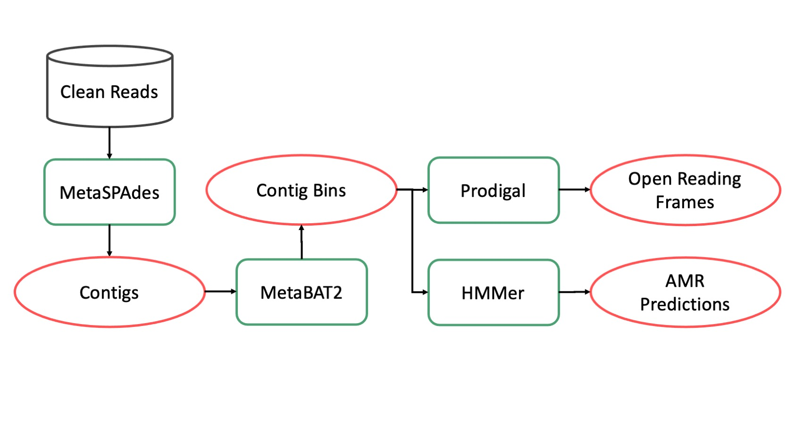

Assembly
=======
.. _Assembly:

The assembly subpipeline generates large sequence assemblies and analyzes them for a number of analyses. It runs on data that has been processed with the preprocessing pipeline.

Modules
^^^^^^

MetaSPAdes
----------

`MetaSPAdes <http://cab.spbu.ru/software/meta-spades/>`_ generates high quality assemblies of microbial genomes from metagenomic data. The assemblies can be used for a number of downstream analyses including identifying Metagenome Assembled Genomes, gene clusters, and refined taxonomic profiles.

MetaSPAdes produces a number of output files `which are detailed here <https://github.com/ablab/spades#spadesoutsec>`_. Most downstream analyses use eitheer the `contigs` or `scaffolds` file. An example of the output files from this module may be found on `Pangea <https://pangeabio.io/samples/eb8b8354-2cb3-43a7-8126-67c1c12cf684/analysis-results/53f29fcd-8ab9-4a1d-a579-7dca0c13bfb7>`_.

.. autoclass:: cap2.pipeline.assembly.MetaspadesAssembly