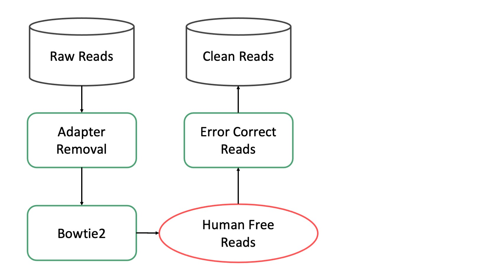
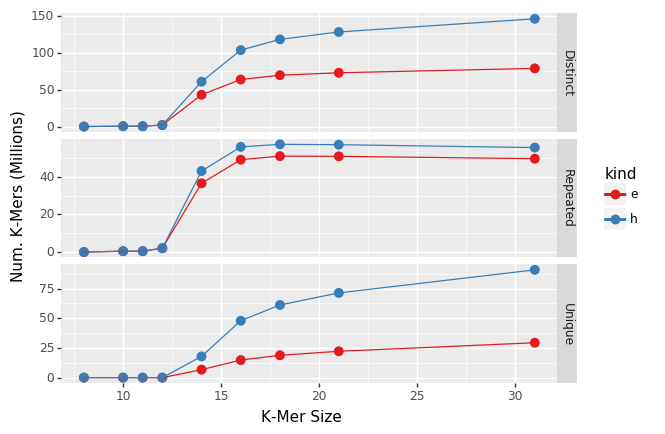

Preprocessing
========
.. _Preprocessing:

The preprocessing pipeline produces high quality clean reads for the rest of the pipeline to consume. It removes low quality sequences, fitlers sequences from potential host species (Human, Mouse, etc), and performs error correction. It runs directly on raw sequencing data.

Modules
^^^^^^

Adapter Removal
---------------

`AdapterRemoval <https://adapterremoval.readthedocs.io/en/latest/>`_ removes remnant adapter sequences from and trims low quality bases from the 3’ end of reads. Adapter sequences are typically removed as part of the basecalling process but removing potential adapter sequences is fast and good practice. Additionally removing very low quality bases from the ends of reads reduces potential downstream error.

AdapterRemoval produces one fastq file per input file (one for single end, two for paired end). These files contain the same reads as their input counterparts except cleaned. 

.. autoclass:: cap2.pipeline.preprocessing.AdapterRemoval

Mouse Removal
-------------

This module removes reads that map to the mouse genome. It uses `Bowtie2 <http://bowtie-bio.sourceforge.net/bowtie2/index.shtml>`_ to map reads to the mm39 genome using the `--very-sensitive` preset mode. Removing mouse DNA is critical for studies of mouse microbiomes but it is also useful for non-mouse studies where it helps to remove contaminants that likely are not microbial.

Mouse Removal produces three files. A pair of fastqs (just one when processing single ended data) and a BAM file recording the alignments. The fastqs contain the reads that did not map to the mouse genome.

.. autoclass:: cap2.pipeline.preprocessing.RemoveMouseReads

Human Removal
-------------

Most microbiome samples contain some amount of human genetic material. There are two main sources for this: human contamination during sample preparation and human material present in samples from human (e.g. from a cheek swab). Removing human sequences reduces possible misidentification as a microbial taxon.

Human sequence removal relies on Hg38 with alternate contigs. Without alternate contigs large amounts of human sequence may not be identified in some samples. In some cases genuine microbial sequences may be misidentified as human sequences. This could be particularly true in studies of retroviruses. However, in most cases, removing human sequence decreases false positives and decreases downstream processing time.

This module removes reads that map to the human genome. It uses `Bowtie2 <http://bowtie-bio.sourceforge.net/bowtie2/index.shtml>`_ to map reads to the Hg38 genome (with alternate contigs) using the `--very-sensitive` preset mode. Removing human DNA is critical for essentially every microbiome study since all samples are handled by humans at some point and may contain some fraction of human DNA that could otherwise be mistakenly classified as microbial.

Human Removal produces three files. A pair of fastqs (just one when processing single ended data) and a BAM file recording the alignments. The fastqs contain the reads that did not map to the human genome. An example of the output files from this module may be found on `Pangea <https://pangeabio.io/samples/bb81df30-50ab-442b-b799-3322e48bf740/analysis-results/a33abb9c-3394-4118-9132-bfc07cba4f4b>`_.

.. autoclass:: cap2.pipeline.preprocessing.RemoveHumanReads

Error Correction
----------------

All types of sequencing introduce errors to sequences. While these errors are generally rare (error rates les than 1% are common) they can still introduce noise to downstream analyses. Error correcting reads is useful to reduce noise and improve downstream analyses.

   y-axis gives the number of k-mers, blue points are raw data while red is after error correction. Distinct is the total number of k-mers, repeated are k-mers that occur at least twice, Unique are k-mers that occur just once.

Error correction in the CAP uses BayesHammer, ordinarily the first step in the MetaSPAdes assembly pipeline. Roughly speaking BayesHammer tries to find k-mers that are just one base different than another, more abundant, k-mer and replaces the less abundant k-mer with the more abundant. As can be seen in the graph above error correction with BayesHammer (red line) substantially reduces the number of unique k-mers (k-mers that occur just once) without substantially reducing the number of repeated k-mers that occur more than once.

A caveat of BayesHammer is that it reduces strain diversity in metaomics since low abundance bacterial strains look similar to sequence errors. This means that downstream strain calling tools generally should not use error corrected reads.

Error correction is done with BayesHammer and does not require a database. It is performed after human removal and is the last stage in the preprocessing subpipeline. It produces two fast files (one in single ended mode) and an example of the output files from this module may be found on `Pangea <https://pangeabio.io/samples/bb81df30-50ab-442b-b799-3322e48bf740/analysis-results/35e85427-d806-48e3-adb5-96f38cddf4c6>`_.

.. autoclass:: cap2.pipeline.preprocessing.ErrorCorrectReads
